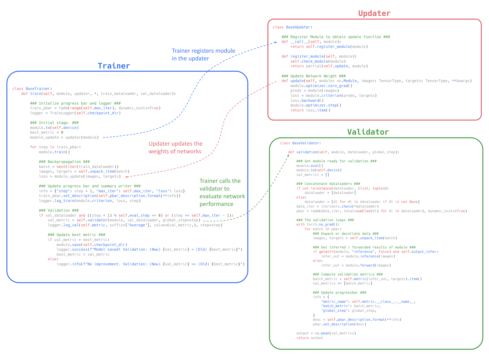

# DeepLake

[](https://www.python.org)  [](https://pytorch.org) [](https://github.com/psf/black)

> Simple deep learning templates. Presented by Laboratory of Analytics on Knowledge Engineering
(LAKE).<br>
> 簡單好用的深度學習訓練模板

### Framework Overview
The framework / template is mainly built upon three components: `Trainer`, `Updater`, and `Validator`.


* **Trainer**: Manages the overall training process, including initialization, progress tracking, and coordinating between the updater and validator.
* **Updater**: Handles network weight updates during training, with customizable update functions for different optimization strategies.
* **Validator**: Evaluates model performance on validation data, providing metrics to assess training progress.

The architecture is designed for flexibility, allowing users to easily customize or extend each component. This structure supports efficient development and experimentation with various neural network models and training approaches.

## Installation and Requirements
1. Install [PyTorch](https://pytorch.org/) and clone this repo by running
```
git clone https://github.com/kevinkevin556/deeplake.git
```
2. (manual) Install dependencies: `monai[pydicom]`,  `ruamel.yaml`, `tqdm`, `loguru`, `tensorboard`, `dicom2nifti`,  `opencv-python`, `jsonargparse[omegaconf]`
  * We utilize [jsonargparse](https://github.com/omni-us/jsonargparse) to generate a easy-to-use CLI automatically.
3. (pip) Or run the following command in the terminal to install requirements
```setup
pip install -r requirements.txt
```
## Train and Evaluate Models using CLI

🔥 To **train** the models, run this command:

```train
python train.py --config <path_to_config_file>
```

🔥 To **evaluate** the model, run:

```eval
python test.py --config <path_to_config_file>
```

📋 See the example `[lenet06] train-cli.py` in [notebooks](./notebooks/) to build your own training/testing CLI.


## Imports
This project is setup as a package which means you can now easily import any file into any other file like so:

```python
from deeplake.modules.base.trainer import BaseTrainer
from deeplake.modules.base.updater import BaseUpdater
from deeplake.modules.base.validator import BaseValidator

lenet = LeNet5().cuda()
validator = BaseValidator(metric=batch_acc)
updater = BaseUpdater()
trainer = BaseTrainer(max_iter=1000, eval_step=334, validator=validator)

# train
trainer.train(
  module=lenet,
  updater=updater,
  train_dataloader=train_dataloader,
  val_dataloader=val_dataloader
)

# test
validator.validation(module=lenet, dataloader=test_dataloader)
```

📋 See notebooks [[lenet01-05]](./notebooks/) to use this framework as a package.

## Supports

* [Segmentation Models (smp)](https://github.com/qubvel-org/segmentation_models.pytorch)
* [Monai]()


<!--
## Contributing

>📋  Pick a licence and describe how to contribute to your code repository. 

--> 


